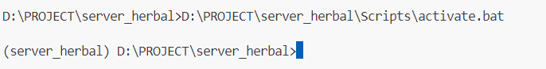

# How To Start
python version 3.10 - 3.12

Jalankan

```
    python -m venv .
```

https://docs.python.org/3/library/venv.html

Kemudian activate venv

```
    path_directory/Scripts/activate.bat
```




Pastikan disampingnya ada nama folder dikurung = (server_herbal)

Kemudian install
```
    pip install -r requirements.txt
```

Menjalankan Server

```
    python run.py
```